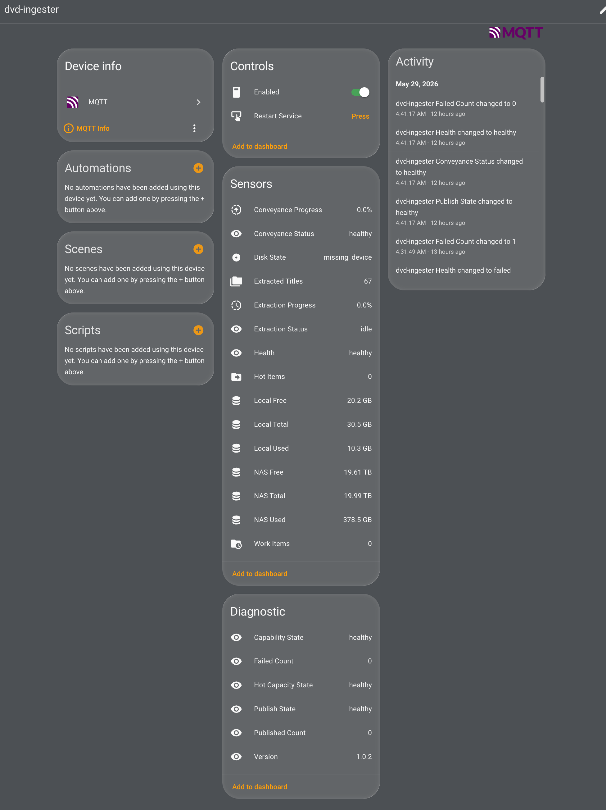

# dvd-ingester

Current release: 1.0.3

`dvd-ingester` is a Muster example implementation for a Raspberry Pi OS or
Debian box with a USB optical drive and a mounted media destination. It models a
small, unattended DVD ingest appliance: insert a disc, let systemd own the
bounded rip job, stage completed output locally, create a direct-play sidecar
when configured, then publish finished titles to cold storage with an atomic
handoff.

It implements the Muster Pattern Library
`T2R4.device-triggered-conveyor` pattern: a device event triggers one bounded
ingest job, the job proves cold storage, waits for hot-storage capacity, stages
local work, and hands completed output to a timer-driven hot/cold conveyor.
In this implementation, udev only asks systemd to start the bounded service.
It also implements `T2R6.home-assistant-mqtt-bridge` as an optional local
Home Assistant MQTT discovery, telemetry, and scoped-control bridge.



The Home Assistant device page is the human-facing control and status view for
this example. The MQTT bridge publishes an enabled switch, a restart button,
extraction and conveyance status, disk state, local and NAS capacity, folder
counts, version, and diagnostic health. The activity feed shows state changes as
they happen, which makes it clear whether the appliance is idle, ripping,
publishing, missing a drive, waiting on capacity, or recovering from a failed
pass.

## What This Example Demonstrates

- Hardware events request systemd work; udev never runs long jobs directly.
- A local hot cache absorbs rip output before a timer-driven publish pass moves
  complete titles to cold storage.
- Destination and capacity gates fail visibly instead of silently filling the
  wrong disk.
- Home Assistant MQTT discovery exposes the appliance as a single device with
  retained state and narrow controls.
- JSON state files, doctor checks, timers, idempotent install, rollback, package,
  and tests make the example inspectable as an appliance, not just a script.

## Requirements

- Raspberry Pi OS or Debian with systemd and udev.
- A USB optical drive that appears as `/dev/sr0` or another stable block device.
- A mounted destination such as a NAS share at `DEST_DIR`.
- Enough local hot-cache space for at least one disc-sized handoff.
- A ripper command: either install `dvdbackup` or `makemkvcon`, or set a custom
  `RIP_COMMAND`.
- Optional for archive sidecars: `HandBrakeCLI` and `lsdvd`.
- Optional for Home Assistant: MQTT enabled in Home Assistant and
  `mosquitto_pub` available on the ingester host.

## Architecture

```text
DVD media becomes ready
  -> udev rule adds SYSTEMD_WANTS=dvd-rip@%k.service
  -> systemd runs /opt/dvd-ingester/current/bin/dvd-rip-one /dev/%I --apply
  -> dvd-rip-one proves DEST_DIR and waits for HOT_DIR capacity
  -> archive rips add a direct-play main-feature.mkv sidecar
  -> completed rip moves to HOT_DIR/<disc-title>_<fingerprint>
  -> dvd-publish-one.timer drains HOT_DIR to DEST_DIR
  -> publish writes DEST_DIR/.incoming-<disc-title>_<fingerprint> and atomically renames final output
```

## MPL Pattern Mapping

| dvd-ingester boundary | MPL vocabulary | Evidence |
| --- | --- | --- |
| Optical drive event only requests systemd | `R2.device-binding`, `C1.service-capsule` | `udev/90-dvd-ingester.rules`, `systemd/dvd-rip@.service` |
| Destination is proven before high-volume writes | `R5.capability-mount`, `C4.lazy-resource-gate` | `src/dvd-rip-one`, `src/dvd-publish-one` |
| Local hot work drains to mounted cold storage | `T2C1.hot-cold-nas-conveyor` | `HOT_DIR`, `.ingest-complete`, `src/dvd-publish-one` |
| Repeated drain, doctor, and update checks | `C2.persistent-tick`, `T2C3.scheduled-herald` | `systemd/*.timer` |
| Degraded and failed states remain inspectable | `C5.failure-ratchet` | JSON state files under `STATE_DIR` |
| Install, update, uninstall, package lifecycle | `C6.lifecycle-capsule` | `bin/*.sh`, `Makefile`, `dist/manifest.json` |
| Home Assistant discovery and controls | `T2R6.home-assistant-mqtt-bridge` | `src/dvd-ha-mqtt-bridge`, `src/dvd-control`, `systemd/dvd-ingester-ha-mqtt.*` |

## Install

From a checkout:

```sh
sudo ./bin/install.sh
```

From a published release:

```sh
curl -fsSL https://github.com/azide0x37/dvd-ingester/releases/latest/download/install.sh | sudo sh
```

For staged verification without touching the host:

```sh
MUSTER_ROOT="$(mktemp -d)" MUSTER_SKIP_PACKAGES=1 ./bin/install.sh
```

## Configuration

The installer creates `/etc/dvd-ingester/dvd-ingester.env` from
`etc/dvd-ingester.env.example` and preserves the file on later installs.

| Setting | Default | Purpose |
| --- | --- | --- |
| `DEST_DIR` | `/mnt/media/dvd-ingester` | Mounted cold destination for completed rips |
| `HOT_DIR` | `/var/cache/dvd-ingester/hot` | Local handoff directory drained by the publish timer |
| `WORK_DIR` | `/var/lib/dvd-ingester/work` | Temporary rip workspace |
| `STATE_DIR` | `/run/dvd-ingester` | Runtime JSON state and locks |
| `MIN_HOT_FREE_BYTES` | `10737418240` | Required hot-storage free space before a rip starts |
| `CAPACITY_TIMEOUT_SECONDS` | `900` | Maximum wait for hot capacity |
| `RIP_COMMAND` | empty | Optional override command for real ripping |
| `ARCHIVE_SIDECAR` | `1` | For built-in `dvdbackup` archive rips, create a direct-play MKV beside the preserved DVD archive |
| `ARCHIVE_SIDECAR_FILE` | `main-feature.mkv` | MKV filename written inside the archive folder next to `VIDEO_TS` |
| `ARCHIVE_SIDECAR_TITLE` | `longest` | Title selection policy: `longest`, `title1`, or an explicit numeric title |
| `ARCHIVE_SIDECAR_METADATA_FILE` | `main-feature.json` | Metadata filename recording sidecar title and preset |
| `HANDBRAKE_CLI` | `HandBrakeCLI` | HandBrake executable used for archive sidecar generation |
| `HANDBRAKE_PRESET` | `Fast 480p30` | HandBrake preset used for `main-feature.mkv` |
| `EJECT_AFTER_RIP` | `1` | Eject after successful hot handoff |
| `ALLOW_UNMOUNTED_DEST` | `0` | Permit local, unmounted `DEST_DIR` only when deliberately set |
| `AUTOUPDATE` | `1` | Enable update timer work |
| `UPDATE_MANIFEST_URL` | release manifest URL | Manifest used by `bin/update.sh` |

`RIP_COMMAND` receives `DEVICE`, `RUN_DIR`, `RUN_ID`, and
`DEVICE_FINGERPRINT` in the environment. Output directories are named
`<disc-title>_<fingerprint>` using the DVD filesystem label and a stable
20-character identity hash. If `RIP_COMMAND` is empty, apply mode tries
`dvdbackup` first, then `makemkvcon`. Built-in `dvdbackup` archive rips keep
the preserved DVD directory and, by default, add `main-feature.mkv` beside the
`VIDEO_TS` folder so VLC/Plex/Jellyfin can play the main feature directly
without relying on DVD menu navigation. `ARCHIVE_SIDECAR_TITLE=longest` uses
`lsdvd` to select the longest title and falls back to title 1 when `lsdvd` is
unavailable; set a numeric title when a specific disc needs an override. Mock
mode writes a small payload for tests.

The installer also creates `/etc/dvd-ingester/dvd-ingester.mqtt.env` with mode
`0600`. MQTT is disabled by default:

| Setting | Default | Purpose |
| --- | --- | --- |
| `HA_MQTT_ENABLE` | `0` | Set to `1` to publish with `mosquitto_pub` when available |
| `MQTT_HOST` | `127.0.0.1` | MQTT broker host |
| `MQTT_PORT` | `1883` | MQTT broker port |
| `MQTT_USERNAME` | empty | Optional MQTT username |
| `MQTT_PASSWORD` | empty | Optional MQTT password |
| `MQTT_PUBLISH_TIMEOUT_SECONDS` | `5` | Per-message MQTT publish timeout when `timeout(1)` is available |
| `HA_DISCOVERY_PREFIX` | `homeassistant` | Home Assistant discovery prefix |
| `HA_TOPIC_PREFIX` | `muster/dvd-ingester` | State and command topic prefix |
| `HA_NODE_ID` | `dvd_ingester` | Stable Home Assistant MQTT node identifier |
| `HA_DEVICE_NAME` | `dvd-ingester` | Device name shown in Home Assistant |
| `DISC_DEVICE` | `/dev/sr0` | Optical device probed for disk state |
| `HA_FOLDER_INDEX_LIMIT` | `50` | Maximum folder names attached to folder-count sensors |

When MQTT is disabled or no broker tools are installed, the bridge still writes
mockable payloads under `STATE_DIR/ha-mqtt-outbox`.
When `HA_MQTT_ENABLE=1`, `mosquitto_pub` must be installed and able to reach the
configured broker. Publish failures make `dvd-ingester-ha-mqtt.service` fail so
the journal shows a real delivery problem instead of a false success.

## First Run

1. Install the package or run the installer from a checkout.
2. Edit `/etc/dvd-ingester/dvd-ingester.env` so `DEST_DIR` points at mounted
   cold storage and `HOT_DIR` points at local storage with enough free space.
3. Leave `ALLOW_UNMOUNTED_DEST=0` unless the destination is deliberately local;
   this prevents a missing NAS mount from silently filling the root disk.
4. Run `/opt/dvd-ingester/current/bin/doctor.sh` before inserting the first disc.
5. Insert a disc and watch the rip/publish journals:

   ```sh
   journalctl -u 'dvd-rip@*' -u dvd-publish-one.service -f
   ```

To enable Home Assistant:

1. Install `mosquitto-clients` or otherwise provide `mosquitto_pub`.
2. Edit `/etc/dvd-ingester/dvd-ingester.mqtt.env`, set `HA_MQTT_ENABLE=1`, and
   configure `MQTT_HOST`, `MQTT_PORT`, and credentials if needed.
3. Start one bridge refresh with
   `sudo systemctl start dvd-ingester-ha-mqtt.service`.
4. In Home Assistant, open the MQTT integration and look for the `dvd-ingester`
   device. Add the health, extraction, conveyance, disk, and storage entities to
   the dashboard you use for media operations.

## systemd Units

| Unit | Purpose |
| --- | --- |
| `dvd-rip@.service` | One bounded rip job for `/dev/%I` |
| `dvd-publish-one.service` | One hot-to-cold publish drain pass |
| `dvd-publish-one.timer` | Periodic publish drain |
| `dvd-ingester-doctor.service` | Health check |
| `dvd-ingester-doctor.timer` | Periodic health check |
| `dvd-ingester-update.service` | Release manifest update check |
| `dvd-ingester-update.timer` | Periodic update polling |
| `dvd-ingester-ha-mqtt.service` | Publish Home Assistant discovery/state and process scoped controls |
| `dvd-ingester-ha-mqtt.timer` | Periodic Home Assistant bridge refresh |

## Operations

Run a doctor check:

```sh
/opt/dvd-ingester/current/bin/doctor.sh
```

Drain hot storage manually:

```sh
sudo systemctl start dvd-publish-one.service
```

Backfill direct-play sidecars for existing archive rips:

```sh
sudo /opt/dvd-ingester/current/bin/backfill-archive-sidecars.sh /mnt/media/dvd-ingester --apply
```

Inspect the latest runtime states:

```sh
sudo ls -l /run/dvd-ingester
sudo cat /run/dvd-ingester/rip.json
sudo cat /run/dvd-ingester/publish.json
sudo cat /run/dvd-ingester/ha-mqtt-state.json
```

Refresh Home Assistant state manually:

```sh
sudo systemctl start dvd-ingester-ha-mqtt.service
```

Disable new ingest without stopping the bridge:

```sh
sudo /opt/dvd-ingester/current/bin/dvd-control --apply disable
```

Enable new ingest again:

```sh
sudo /opt/dvd-ingester/current/bin/dvd-control --apply enable
```

Restart owned background services without stopping active rip jobs:

```sh
sudo /opt/dvd-ingester/current/bin/dvd-control --apply restart
```

Inspect the Home Assistant bridge status payload:

```sh
sudo /opt/dvd-ingester/current/bin/dvd-control --apply status
```

Watch logs:

```sh
journalctl -u 'dvd-rip@*' -u dvd-publish-one.service -f
```

## Home Assistant Entities

When `HA_MQTT_ENABLE=1`, the bridge publishes a Home Assistant MQTT device
discovery payload and appliance state. The entity set is intentionally scoped to
operator decisions for this appliance:

| Entity | Purpose |
| --- | --- |
| Availability | Shows whether the bridge can publish current state |
| Health status | Summarizes doctor, rip, publish, and maintenance state |
| Disk state | Reports whether the configured optical device is loaded, busy, missing, or has no media |
| Rip state | Shows active or latest extraction state |
| Extraction progress | Reports current rip bytes against the disc size from metadata as a percentage |
| Publish state | Shows conveyor handoff and cold-destination publish state |
| Conveyance progress | Reports active NAS publish bytes against the hot source size as a percentage |
| Capability and capacity state | Reports destination mount/write health and local hot-cache capacity pressure |
| Local storage | Reports local hot-cache used, free, and total capacity in GiB |
| Destination storage | Reports mounted destination used, free, and total capacity in GiB |
| Folder indexes | Counts work, hot, and completed title directories; bounded directory names are published as MQTT sensor attributes |
| Publish counts | Reports the latest publish drain's published and failed counts |
| Version | Reports the installed `dvd-ingester` version as a diagnostic sensor |
| Restart button | Restarts owned background services without stopping active rip jobs |
| Enabled switch | Blocks or restores new ingest while leaving the bridge online |

Use the device page as a triage view:

- `healthy` means the last bridge refresh could publish current state and the
  latest doctor, capacity, and publish states are acceptable.
- `degraded` means the appliance is still inspectable but needs operator
  attention, usually because a mount, capacity gate, disk probe, or publish pass
  is not in the expected state.
- `failed` means a bounded action failed and left evidence in `STATE_DIR` and
  the systemd journal.
- `missing_device` on Disk State means the configured `DISC_DEVICE` does not
  exist from the bridge's point of view; check USB power, device naming, and
  udev before debugging the ripper.
- A non-zero Failed Count is about the latest publish/bridge result, not a
  permanent total. Use it with the Activity feed and journal to find the exact
  failing pass.

Folder index entities intentionally keep counts in the sensor state and put
directory names in `json_attributes_topic` payloads. This keeps Home Assistant
state history small while still exposing the current work queue, hot handoff
queue, and completed title folders for dashboards and automations. The default
attribute list limit is `50` entries and can be changed with
`HA_FOLDER_INDEX_LIMIT`.

## Update And Rollback

`bin/update.sh` reads `/etc/dvd-ingester/dvd-ingester.env`, exits cleanly when
`AUTOUPDATE=0`, downloads `manifest.json`, verifies the artifact SHA256,
unpacks the new release under `/opt/dvd-ingester/releases/<version>`, switches
`/opt/dvd-ingester/current`, restarts timers, and runs `doctor.sh`.

If the doctor check fails, the updater logs the captured doctor stdout/stderr,
restores the previous `current` symlink, and restarts the timers again.

## Adjacent Systems

`dvd-ingester` stops at publishing DVD output. Plex, Jellyfin, HandBrake,
library managers, or desktop import tools should watch `DEST_DIR` after the
atomic final directory appears. They should not read `.incoming-*` directories.

## Tests

```sh
make test
make package
```

The test suite uses mock mode for the conveyor flow and staged roots for
installer idempotence. It does not require a DVD drive or a mounted NAS.

## Release Documentation Cycle

Every push that changes behavior, config, controls, units, packaging, or release
assets must refresh the operator-facing docs before it is considered complete:

1. Update `README.md` so install, config, operations, Home Assistant entities,
   self-certification, and known limits match the implementation.
2. Update `RELEASE.md` with the release-facing change notes.
3. Run `make changelog` to regenerate `CHANGELOG.md` from `RELEASE.md`.
4. Run `make test` and `make package`; both verify that the README and
   generated changelog are current enough to ship.

## Known Limits

- Built-in archive sidecar title selection is heuristic. `longest` works for
  ordinary feature discs but TV, bonus, and deliberately confusing authoring may
  need `ARCHIVE_SIDECAR_TITLE` or a custom `RIP_COMMAND`.
- Apply mode expects the operator to configure legal ripping tools for their
  jurisdiction and media.
- The publish drain copies to a destination-side temporary directory before the
  final rename. It is atomic for readers of final output, but interrupted
  copies may leave `.incoming-*` directories for inspection.
- MQTT command handling is deliberately narrow. Restart does not stop active
  `dvd-rip@*.service` jobs, and disable leaves the Home Assistant bridge alive
  so it can be re-enabled.

## Muster Self-Certification

| Requirement | Status | Evidence |
| --- | --- | --- |
| systemd owns lifecycle | PASS | `systemd/dvd-rip@.service`, publish, doctor, and update units |
| timer-based update polling exists | PASS | `systemd/dvd-ingester-update.timer` |
| timer-based drain/status work exists | PASS | `systemd/dvd-publish-one.timer`, `systemd/dvd-ingester-doctor.timer` |
| config under `/etc/dvd-ingester` | PASS | `bin/install.sh`, `etc/dvd-ingester.env.example` |
| code under `/opt/dvd-ingester/releases/<version>` | PASS | `bin/install.sh` |
| current symlink managed atomically | PASS | `bin/install.sh`, `bin/update.sh` |
| idempotent installer exists | PASS | `tests/test_installer_idempotent.sh` |
| rollback path exists | PASS | `bin/update.sh` restores previous `current` on failed doctor |
| doctor check exists | PASS | `bin/doctor.sh` |
| release artifacts buildable | PASS | `make package` |
| tests runnable | PASS | `make test` |
| systemd units verify when available | PASS | `tests/test_units.sh` runs `systemd-analyze verify` when installed |
| installer preserves config | PASS | staged idempotence test appends and rechecks config |
| generated instructions avoid unmanaged files | PASS | only `/etc/dvd-ingester/dvd-ingester.env` is operator-edited |
| Home Assistant bridge exists | PASS | `T2R6.home-assistant-mqtt-bridge`, `dvd-ingester-ha-mqtt.service`, `tests/test_ha_mqtt_bridge.sh` |
| MPL pattern mapping documented | PASS | README, `MUSTER.md`, and `muster.yaml` name `T2R4.device-triggered-conveyor` and `T2R6.home-assistant-mqtt-bridge` |
